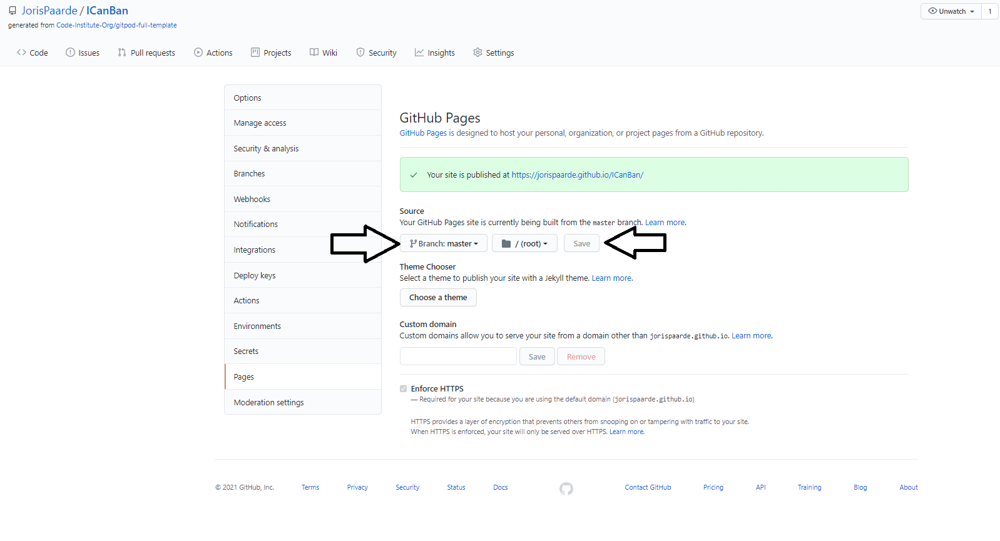

# I CanBan

## ICanBan is an easy to use canban system.

The goal of this website is to deliver an easy and appealing way to manage to do's.
Add items to your to do list, move them to the doing list and eventually to the done list.
It features include among other things, renamable and resizable columns and a dark mode setting.
All data is stored in localstorage so will only be stored in your local browser.
This project was made as a second milestone project for the Code Institute full Stack Web developer course.


[View the live project here](https://jorispaarde.github.io/ICanBan/index.html)


## Table of Contents
- [UX](#user-experience-(ux))
  - [User stories](#user-stories)
  - [Design](#design)
  - [Mockup](#mockup)
- [Features](#features)
- [Technologies Used](#technologies-used)
- [Testing](#testing)
- [Deployment](#deployment)
  - [Github Pages](#github-pages)
  - [Making a clone](#making-a-local-clone)
  - [EmailJS Setup](#setting-up-your-emailJS)
- [Credits](#credits)

## User Experience (UX)

### User stories

### General functionality:

#### As a First Time Visitor, I want to:

1. Get a short description about what ICanBan is.
2. Have quick access to more information on Kaban.
3. Have a clear understanding of the controls on the page.
4. Have Quick access to navigation on the site.

#### As a Returning Visitor, I want to:

1. Quickly access my personal Kanban page without having to go trough the menu.
1. Give feature suggestions for the site.

### Settings functionality:

#### As a visitor to the settings page , I want to:

1. Change the site to dark mode or light mode.
1. Add a column to my Kanban.
1. Change the name of a column.

### Kanban functionality:

#### As a visitor to MyKanban page , I want to:

1. Add a card to a column.
1. Enter text in a new card.
1. Move a card to another column.
1. Expand or contract the size of a column.
1. Delete a card.
1. Only be presented with usefull controls in a canban item.
1. Easily be able to access all columns on all screensizes and orientations.

### Design

#### Colour Scheme

For the colors on this website a soft red yellow and green were chosen.

- Red : The color red is used to draw attention and inspire action. Therefore suited for our "To do" list.
        The user is drawn to the items on the list and inspired to take action on them.

- Yellow : Yellow is a color that stimulates and energizes. Therefore suited for our "Doing" list.
        The user is stimulated and energized to complete these tasks.

- Green : Green revitalizes and encourages ideal for the "Done" section of our page.
        After completing a task revitalized nad encouraged by the color green it's back to work o the next task!

source: [color meaning and psycology](https://graf1x.com/color-psychology-emotion-meaning-poster/)

#### Typography

Font: [Raleway](https://fonts.google.com/specimen/Raleway?preview.text_type=custom#standard-styles)

About:

Raleway is an elegant sans-serif typeface family. Initially designed by Matt McInerney as a single thin weight,
it was expanded into a 9 weight family by Pablo Impallari and Rodrigo Fuenzalida in 2012 and iKerned by Igino Marini.
A thorough review and italic was added in 2016.
It is a display face and the download features both old style and lining numerals, standard and discretionary ligatures,
a pretty complete set of diacritics, as well as a stylistic alternate inspired by more geometric sans-serif typefaces than its neo-grotesque inspired default character set.


#### Imagery

-   The image on the main page is a screenshot of the mycanban page, giving the user a quick view of what the canban system looks like.

### Mockup

-  The mockup of this site was made in Figma. U can view it [here](https://www.figma.com/file/y5LdwdHOZVvlOjnidnMRb4/ICanBan?node-id=0%3A1) 


---

## Features

### Current Features

####   All pages

-   Responsive on all device sizes
-   Collapsing hamburger menu
-   Dark mode

####   main page

-   Introduction text
-   Visual of mycanban page
-   Controls section
-   Email form with extensive validation

#### settings page

-   Animated sliders
-   Text field input
-   Direct link to MyCanban page

#### MyCanban page

-   Add item to a column with autofocus
-   Text field input
-   Remove item with confirmation modal
-   Move items to adjacent column
-   Expandable and contractable columns
-   Alternate layout on mobile
-   Responsive display of controls
-   Hidden items indication

### Possible future Features

-   Database : Store all data in a database so the user can access his/her canban from any device and browser.
-   Accounts : Login to a specific canban list with an account to make collaboration possible (this needs the database also).
-   Adding more columns like testing or other.
-   More content in items like owner, file attachments, by expanding when a user clickes an item. 

---

## Technologies Used

### Languages Used

-   [HTML5](https://en.wikipedia.org/wiki/HTML5)
    - HTML5 was used to build the main structure and content of the page.
-   [CSS3](https://en.wikipedia.org/wiki/Cascading_Style_Sheets)
    - CSS3 was used to give the html styling and layout.
    And to make the page responsive to differentscreen sizes.
-   [Javascript](https://nl.wikipedia.org/wiki/JavaScript)
    - Javascript was used for the email form functionality and all website altering functions, like adding and moving items, darkmode etc. also for storing data in localstorage.

### Frameworks, Libraries & Programs Used

1. [Bootstrap 4.4.1:](https://getbootstrap.com/docs/4.4/getting-started/introduction/)
    - Bootstrap was used to create the responsive structure of the website.
1. [Google Fonts:](https://fonts.google.com/)
    - Google fonts was used to import the 'Montserrat' font into the style.css file.
1. [Font Awesome:](https://fontawesome.com/)
    - Font Awesome was used on all pages throughout the website to add the social icons.
1. [jQuery:](https://jquery.com/)
    - jQuery came with Bootstrap to make the navbar responsive. Also used in various script files.
1. [Git](https://git-scm.com/)
    - Git was used for version control by utilizing the terminal in gitpod to regularly commit, with comments, to Git and Push to GitHub.
1. [GitHub:](https://github.com/)
    - GitHub is used to store the projects code and assets and to fork the project for the customer.
1. [Figma:](https://figma.com/)
    - Figma was used to create the website design and prototype.
1. [TinyPNG](https://tinypng.com/)
    - TinyPNG was used to compress images to ensure faster load times.
1. [Browserstack](https://live.browserstack.com/)
    - To test the site on a variety of devices and browsers.

---

## Testing

All testing can be found [here](TESTING.md).

---

## Deployment

### GitHub Pages

The project was deployed to GitHub Pages using the following steps...

1. Log in to GitHub
2. Locate the [repository](https://github.com/JorisPaarde/ICanBan).
3. Go to settings menu: <h4 align="center"></h4>
4. scroll down to the bottom of the page.
5. Select master and save. <h4 align="center"></h4>
6. View the published result. (This may take some time to show up correctly.) <h4 align="center"></h4>

### Making a Local Clone

#### To make a local clone of this project on linux , follow these steps:

1. Make sure u have git installed on your device.
   If u haven't find out how to do that [here](https://git-scm.com/book/en/v2/Getting-Started-Installing-Git).
2. Log into GitHub.
3. Locate the [repository](https://github.com/JorisPaarde/ICanBan).
4. Copy the link to the repository here: <h4 align="center"></h4>
5. Open a terminal and enter the following command (inside the directory u want the repository to be placed):

```
$ git clone https://github.com/JorisPaarde/ICanBan.git

```

7. Press Enter. Your local clone will be created.

```
$ git clone https://github.com/JorisPaarde/ICanBan.git
Cloning into Git …
remote: Counting objects: 25, done.
remote: Compressing objects: 100% (25/25), done.
remove: Total 25 (delta 1), reused 0 (delta 1)
Unpacking objects: 100% (25/25), done.
```
8. your local clone is now ready.

#### To make a local clone of this project in Windows , follow [these](https://www.jcchouinard.com/clone-github-repository-on-windows/) steps.

### Setting up your EmailJS

To set up the email service for the email form:
- Go to: [EmailJS](https://dashboard.emailjs.com/sign-up) to sign up for an account.
- Add your email service by going to email services and add new service.
- Under email templates create a new template.
- Under settings , give your template an id of "contact-form", this will make sure the email service will work with this code.
- Copy your service id by clicking on your newly created email service under email services as shown here.
<h4 align="center"></h4>
- Replace the id shown here (in the email.js file) by your id.
<h4 align="center"></h4>
- Your email service should now be set up.

---

## Credits

### Code

All the below mentioned code is also marked with comments in the code itself.

-   navbar code was taken and edited from: https://getbootstrap.com/docs/4.0/components/navbar/
-   modal code was taken and edited from: https://www.w3schools.com/howto/howto_css_modals.asp
-   email code was taken and edited from: https://github.com/Code-Institute-Solutions/InteractiveFrontendDevelopment-Resume/blob/master/03-SendingEmailsUsingEmailJS/06-sending_emails/assets/js/sendEmail.js

### Content

-   All content was written by the developer.

### Media

-   All media was created by the developer.

### Acknowledgements

-   My Mentor for pointing me to ux issues i had to adress like asking for confirmation when deleting an item.
-   My fellow students and several other mentors on Slack for their tips and moral support.
-   Special thanks to Simen Daehlin (Eventyret_mentor on slack) for his tireless expanations on slack.
-   The basic Readme layout by Code Institute.

